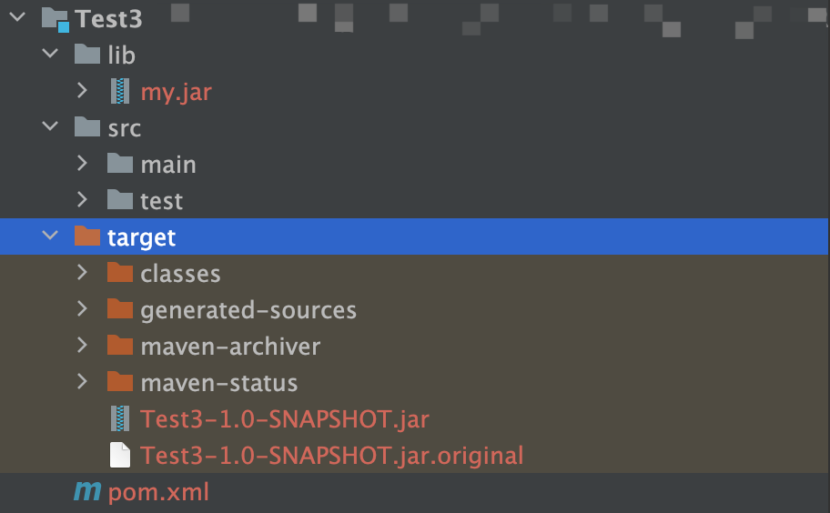
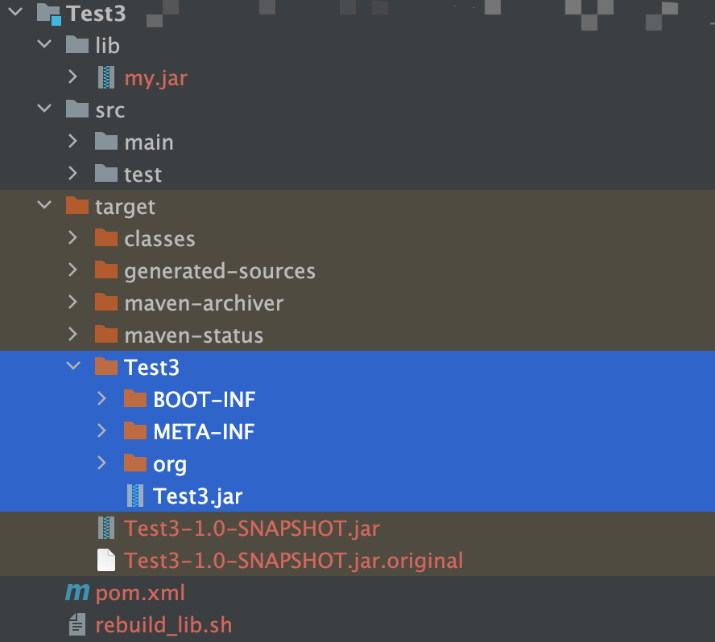

# Intellij_SpringBoot_Rebuild-Lib
Intellij构建SpringBoot引用，包含自定义jar包打包

## 使用
* 在项目目录中新建lib，将自定义jar包均放入其中，并将lib/加入类路径
    
* 利用maven对程序进行打包，生成不包含自定义jar的包
    
* 将`rebuild_lib.sh`脚本放入项目更目录，并执行，生成包含自定义jar的包
    